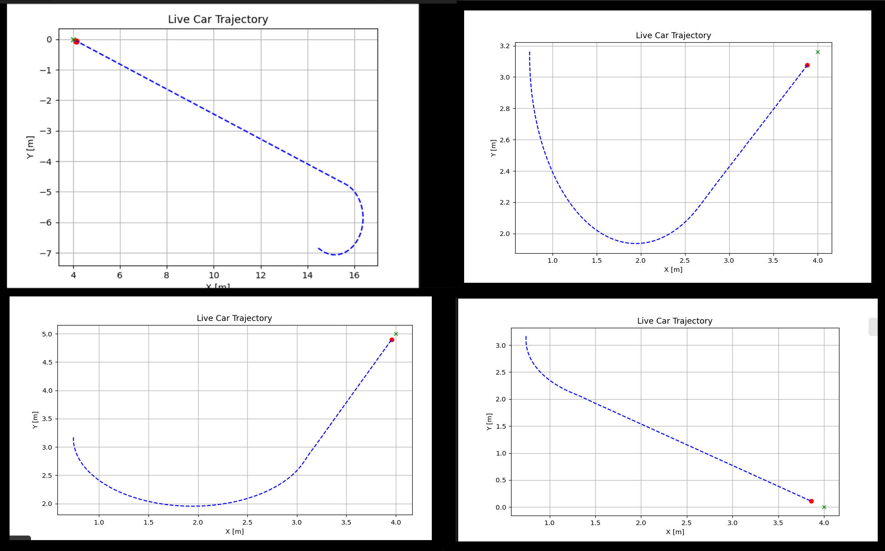
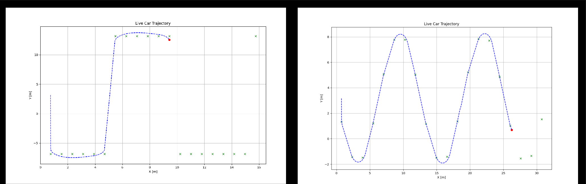
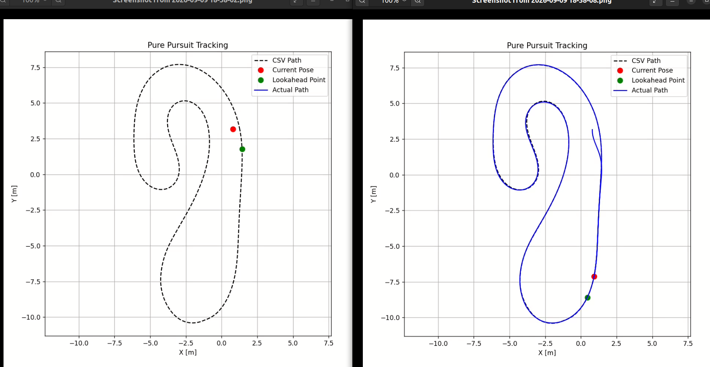

## Development Progression & Experimental Results

### 1. Single Point Verification
Initial validation of coordinate transformations ($R_T$) and curvature calculations toward a static goal point.
* Location: `media/01_single_point/`

### 2. Multi-Point & Mathematical Path Tracking
Testing dynamic target switching across mathematical curves (S-Curves, Sharp Turns, Zig-Zag paths).
* Location: `media/02_generated_paths/`

### 3. Full Track Navigation (ICRA 2026 Competition)
Full-lap navigation on competition racelines using search-window target lookup, and ground-truth comparison.
* Location: `media/03_csv_fixed_lookahead/`

